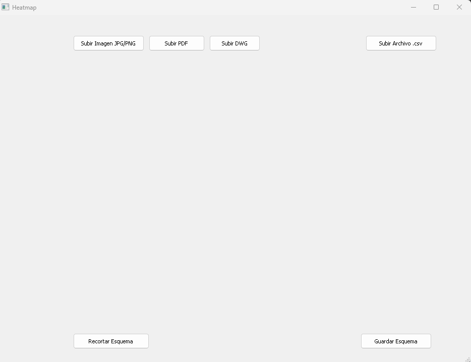
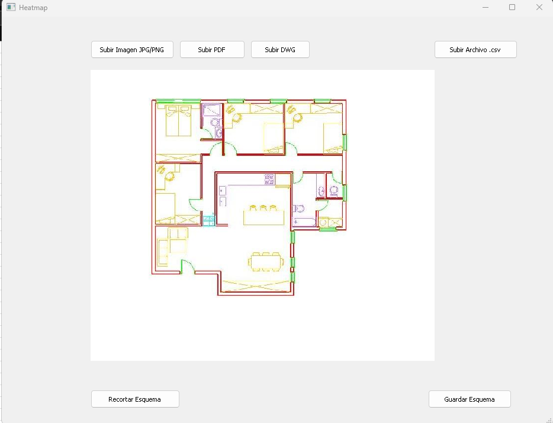
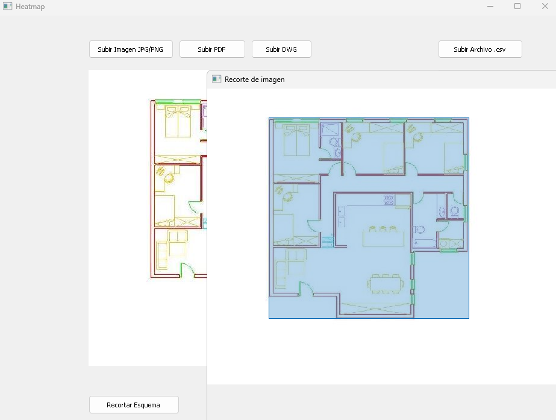
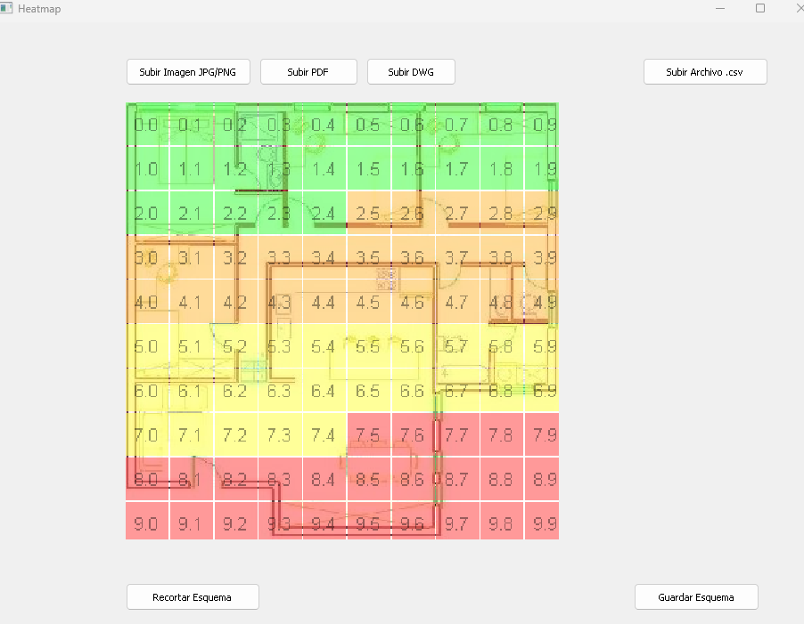

# Proyecto desarrollado durante la primera práctica profesional.

# Procesador de Imágenes y PDFs

Este proyecto es un programa en Python que recibe dos archivos como entrada: un archivo plano en formato PDF o imagen (PNG, JPG, etc.) y un archivo CSV. El programa crea una nueva imagen basada en el archivo PDF o imagen proporcionado, permite recortar la imagen y exportarla en el formato deseado.

## Requisitos

Para ejecutar este proyecto, necesitarás instalar las dependencias listadas en el archivo `requirements.txt`. Puedes instalar estas dependencias usando `pip`:

```bash
pip install -r requirements.txt

```
## Imagenes




